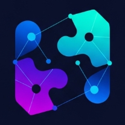

# **AzothSolver Whitepaper** 📄

  

**Version 0.2** — Last Updated: July 29, 2025

---

## Navigation

- [Back to Home](/index.html)
- [Download PDF](/assets/documents/AzothSolver-Whitepaper.pdf)

---

## Abstract

AzothSolver is a performance-focused solver implementation for CoW Protocol, built with Frankfurt-based bare metal infrastructure and optimized for sub-millisecond execution latency. This document outlines our technical architecture, development approach, and transparent progress toward CoW Protocol's shadow competition entry in Q4 2025.

---

## 1. Technical Challenge

CoW Protocol's batch auction system creates a competitive environment where solver performance directly impacts settlement efficiency and user outcomes. Success requires optimizing these key areas:

- **Infrastructure Latency**: Network round-trip time to CoW Protocol infrastructure significantly impacts bid submission timing and settlement opportunities.
- **Routing Efficiency**: Advanced pathfinding algorithms that can identify optimal settlement paths within the auction's time constraints.
- **System Reliability**: Consistent performance under varying network conditions and order volumes.

---

## 2. Technical Implementation

### Infrastructure Architecture

- **Location**: Frankfurt-based bare metal server optimized for <0.5ms latency to CoW Protocol endpoints.
- **Operating System**: Ubuntu 24.04 with real-time kernel patches for predictable scheduling.
- **Networking**: DPDK-based packet processing with kernel bypass for reduced latency variance.
- **Node Setup**: Local node infrastructure for direct blockchain state access and transaction broadcasting.

### Software Stack

- **Core Language**: Rust for performance-critical components with memory safety guarantees.
- **Pathfinding**: Custom graph algorithms optimized for CoW Protocol's batch auction constraints.
- **Monitoring**: Comprehensive telemetry for latency analysis and performance optimization.
- **Testing**: Extensive simulation framework for algorithm validation before deployment.

---

## 3. Development Team

AzothSolver is being developed by an experienced infrastructure engineer with a background in high-performance systems:

- **Lead Developer**: Self-taught engineer with previous experience building and operating large-scale crypto mining infrastructure, cross-chain messaging protocols, and Web3 educational curricula for European institutions.
- **Approach**: Solo development with focus on deep technical understanding and iterative improvement based on real performance data.

---

## 4. System Specifications

| Component             | Specification                                           |
|-----------------------|---------------------------------------------------------|
| Hardware              | High-performance bare metal server (specs optimized for latency) |
| Operating System      | Ubuntu 24.04 + RT kernel                                |
| Primary Network       | Base (Ethereum L2)                                      |
| Monitoring Stack      | Prometheus + Grafana + PostgreSQL                       |
| Execution Environment | Containerized services with custom Rust scheduler        |

---

## 5. Development Roadmap

### Phase 1: Infrastructure Setup (Q3 2025)

- Deploy and configure Frankfurt bare metal server
- Implement monitoring and telemetry systems
- Benchmark latency performance to CoW Protocol endpoints

**Success Metric**: Consistent sub-5 millisecond latency to target infrastructure

### Phase 2: Core Solver Development (Q4 2025)

- Implement basic solver with AMM routing capabilities
- Connect to CoW Protocol shadow competition environment
- Begin performance data collection and analysis

**Success Metric**: Successful participation in shadow competition with measurable performance data

### Phase 3: Algorithm Optimization (Q1 2026)

- Analyze shadow competition performance data
- Implement advanced routing algorithms based on findings
- Optimize for CoW-specific settlement patterns

**Success Metric**: Demonstrable improvement in settlement efficiency metrics

### Phase 4: Network Expansion (Q2-Q3 2026)

- Expand solver capabilities to Ethereum mainnet
- Evaluate additional network opportunities based on CoW Protocol expansion
- Scale infrastructure as needed for multi-network operations

**Success Metric**: Successful operation across multiple networks with maintained performance

### Future Considerations

Long-term development will be guided by:

- Performance data from shadow competition and live operations
- CoW Protocol's roadmap and network expansion plans
- Opportunities for infrastructure optimization and algorithm improvement
- Potential for open-source contributions to the CoW Protocol ecosystem

---

## Contact & Updates

📩 [azothsolver@gmail.com](mailto:azothsolver@gmail.com)  
🌐 [https://azothsolver-web.vercel.app](https://azothsolver-web.vercel.app)  
🐦 [Follow development updates on X - @AzothSolver](https://x.com/AzothSolver)  

*Development progress and performance metrics will be shared transparently as we progress through the shadow competition and beyond.*

© 2025 AzothSolver. All rights reserved.

